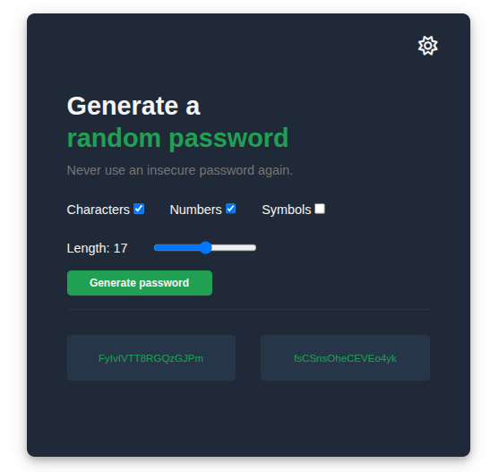
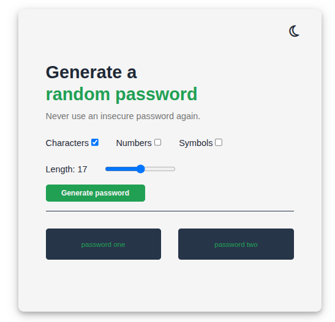

# Random Password Generator

A simple and customizable password generator web app built with HTML, CSS, and JavaScript. Generate secure random passwords with options for including letters, numbers, and symbols, and control password length easily.

---

## Features

- Generate **two passwords at once** with a single click
- Choose to include:
  - Letters (uppercase & lowercase)
  - Numbers
  - Symbols
- Adjustable password length with a slider (4 to 30 characters)
- Light/Dark mode toggle with an icon button
- Click on a generated password to **copy it to clipboard** with confirmation
- Clean, modern, and responsive design

---

## How to Use

1. Open the `index.html` file in your web browser.
2. Select the character types you want to include (letters, numbers, symbols).
3. Adjust the password length using the slider.
4. Click the **Generate password** button.
5. Click on either generated password to copy it to your clipboard.
6. Use the sun/moon icon at the top right to toggle between light and dark modes.

---

## Technologies Used

- HTML5
- CSS3 (Flexbox, custom theming)
- JavaScript (ES6)
- Font Awesome for icons

---

## Project Structure

password-generator/
├── index.html # Main HTML file
├── index.css # Styling file
├── index.js # JavaScript logic for password generation and interactivity
└── README.md # This file

yaml
Copiar
Editar

---

## Code Highlights

- Passwords are generated randomly from selected character sets.
- If no option is selected, the app uses all characters (letters, numbers, symbols) by default.
- Clipboard API is used for copying passwords on click.
- Theme toggling changes colors and icon dynamically.

---

## License

This project is open source and free to use under the [MIT License](LICENSE).

---

## Author

LoloDev

---

## Screenshots

